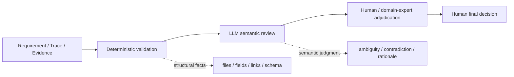

# Requirements-to-Evidence AI V&V Workbench

A small, synthetic work sample showing how to combine **systems/V&V engineering**, **LLM-assisted review**, and **human approval** without treating the LLM as an oracle.

> **Core idea:** verify the engineering artifacts, and verify the AI reviewer too.

This repository uses an AEB-like pedestrian scenario only as a compact public example. It does **not** claim OEM, NCAP, ISO 26262, ASPICE, AUTOSAR, legal, or production-system compliance.


## Review Console

A lightweight static dashboard is included for fast inspection by recruiters, engineers, and reviewers.

Open:

`docs/dashboard.html`

For a local browser preview:

```bash
python scripts/serve_dashboard.py
```

The UI is intentionally **read-only**. Live API credentials are never placed in browser-side JavaScript.

The dashboard shows:

- benchmark result and claim boundary,
- deterministic → LLM → Human review architecture,
- v0.3 → v0.4 evaluation evolution,
- filterable LLM findings,
- human adjudication,
- requirement/test/evidence traceability,
- reproducibility commands and known limitations.

## What this demonstrates

- Requirement → Component → Test → Evidence traceability
- machine-readable synthetic evidence
- negative / false-positive-oriented V&V
- seeded defects and benchmark evaluation
- LLM review with explicit Ground Truth
- Human/domain-expert adjudication of open-ended findings
- deterministic checks for structural facts
- human-controlled final approval
- regression tests and CI

## The engineering problem

An LLM can find useful issues in requirements and evidence, but its output is non-deterministic and can be wrong.

So the workbench separates three responsibilities:



The LLM may create findings. It cannot mark a requirement or test as finally `Verified` or `Approved`.

## Synthetic case

The current case contains:

- **12** synthetic AEB-like requirements
- Requirement → Component → Test → Evidence trace rows
- **5** intentionally seeded benchmark defects:
  1. ambiguous requirement
  2. context contradiction
  3. missing evidence
  4. broken trace
  5. human-approval guardrail violation
- executable slices for brake timing, false-positive suppression, and requirement-quality review

See `requirements/`, `scenarios/`, `evidence/`, and `docs/traceability_matrix.md`.

## Reproduce the work sample without an API key

```bash
python scripts/run_public_demo.py
```

This runs:

1. synthetic V&V,
2. deterministic seeded-defect checks,
3. structural evidence-contract validation,
4. re-evaluation of the saved live LLM findings,
5. regression tests,
6. regeneration of the static review dashboard.

Expected high-level result:

```text
Benchmark: 5/5 known defects detected
Discovery: 1 valid / 1 false positive
Human final approval: required
```

Run the public-safety scan separately:

```bash
python scripts/public_safety_check.py
```

## Optional live LLM review

A live OpenAI API run is optional. The repository can be inspected and reproduced offline using the saved findings.

On Windows:

```powershell
powershell -ExecutionPolicy Bypass -File .\run_live_review.ps1
```

The script reads `OPENAI_API_KEY` into the current process only and removes it afterward. The key is not written to the repository.

## V&V result

### First live evaluation: why `F1 = 0.40` was misleading

The first evaluator used exact matching of:

`finding_type + requirement_id + test_id`

It reported:

- TP = 3
- FP = 7
- FN = 2
- Precision = 0.30
- Recall = 0.60
- F1 = 0.40

Failure analysis showed that this number mixed **model errors** with **evaluation-system errors**:

- requirement-level findings were split by incidental test IDs,
- one ground-truth defect was not observable from the supplied context,
- referenced evidence files were not hydrated into the review context.

See `docs/evaluation_story.md`.

### Corrected evaluation contract

After fixing observability, context hydration, and finding matching:

- seeded benchmark defects detected: **5 / 5**
- benchmark misses: **0**
- benchmark recall on this synthetic set: **1.00**
- additional discovery findings: **2**

Human adjudication of those two discoveries:

| Finding | Human decision |
|---|---|
| RQ-05: “collision risk is cleared” is not operationally defined | **Valid discovery** |
| RQ-09: evidence allegedly lacks `requirement_id` | **False positive** |

The RQ-09 false positive motivated a design change: **do not ask an LLM to decide simple structural facts that deterministic code can verify.**

## Why deterministic-first?

For example, RQ-09 requires a decision record to contain:

- timestamp
- requirement ID
- input state
- trigger reason

A deterministic validator can test those fields exactly.

The LLM is more useful for questions such as:

- Is the requirement objectively testable?
- Are two artifacts semantically inconsistent?
- Is an engineering rationale incomplete?
- Is a newly discovered issue worth expert review?

This boundary reduces avoidable LLM false positives while preserving semantic review value.

## Repository map

```text
requirements/     synthetic engineering requirements
scenarios/        synthetic AEB-like scenarios
evidence/         traces, audit events, results, evaluation artifacts
findings/         saved deterministic and LLM review outputs
scripts/          runners, evaluator, structural validator, safety check
tests/            regression tests
docs/             architecture, evaluation story, limitations, demo guide
.github/workflows verify the offline work sample in CI
```

## Three-minute explanation

See `docs/three_minute_demo.md`.

The short version:

**Problem → Synthetic requirement/evidence set → LLM review → reviewer V&V → failure analysis → deterministic/LLM/human responsibility split.**

## Limitations

The `5/5` result is **not production accuracy**. It is recall on five seeded defects in one small synthetic benchmark.

Known limitations include:

- small benchmark,
- single synthetic domain,
- single live run,
- human adjudication dependency,
- one confirmed LLM false positive,
- no production vehicle/toolchain integration.

See `docs/limitations.md`.

## Public-release status

This repository is publicly released under the **MIT License** with a fresh public history.

The code/data package passes an automated public-safety scan and excludes internal task notes and provider response IDs. The offline work sample is reproducible through the public demo, regression tests, and CI workflow.

Current claim boundary: this is a synthetic engineering work sample, not evidence of production-vehicle accuracy, OEM/NCAP/ISO 26262/ASPICE compliance, or customer deployment.

See `docs/public_release_checklist.md` and `LICENSE`.
