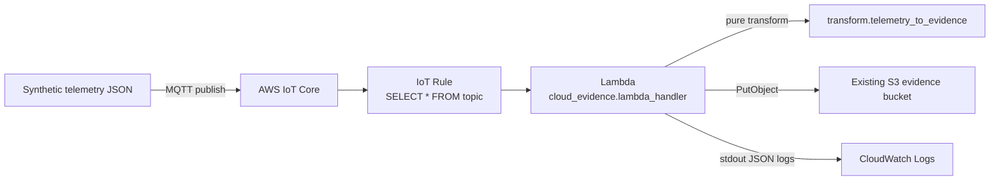

# AWS Cloud Evidence Extension (optional)

An optional, minimal extension that shows how **synthetic** telemetry could be captured as machine-readable evidence in AWS.

> **Claim boundary:** synthetic public work sample only. This is not production telemetry, not a vehicle data pipeline, and not safety or compliance evidence. No reliability, availability, or latency claim is made.

The offline V&V demo (`python scripts/run_public_demo.py`) does **not** import this extension and does not need AWS, credentials, or network access. A regression test enforces that separation.

## Architecture



| Component | File | Responsibility |
|---|---|---|
| Fixture | `cloud_evidence/fixtures/synthetic_telemetry_nominal.json` | One synthetic telemetry message |
| Pure transform | `cloud_evidence/transform.py` | Validate message, build evidence record. No AWS / I/O / clock. |
| Lambda adapter | `cloud_evidence/lambda_handler.py` | Call transform, write S3 object, log one line |
| Contract tests | `tests/test_cloud_evidence.py` | Nominal case, malformed case, offline independence |

### Evidence record

The record carries the fields required by the repository's existing RQ-09 evidence contract (`evidence/evidence_contracts.json`): `timestamp`, `requirement_id`, `input_state`, `trigger_reason`. The nominal contract test checks this against the contract file directly.

The record is **evidence capture only**:

- `evidence_status` is `RECORDED` (never `PASS`, `Verified`, or `Approved`),
- `safety_decision_made: false`,
- `final_approval_performed: false`,
- `human_final_approval_required: true`.

S3 key: `cloud-evidence/telemetry/<device_id>/<message_id>.json`. The key is deterministic, so a retried delivery overwrites the same object instead of creating a duplicate. IDs are restricted to `[A-Za-z0-9._-]{1,64}` so a message cannot choose an arbitrary S3 prefix.

### Failure semantics

| Situation | Behavior |
|---|---|
| Malformed / non-synthetic / unsupported schema | Logged as `telemetry_rejected` (ERROR) in CloudWatch; **no S3 write**; not raised, because a retry cannot fix it |
| S3 write fails | Exception propagates; Lambda async retry and (optionally) an IoT Rule error action apply |
| AWS unavailable entirely | No cloud evidence is captured. The offline V&V demo, deterministic checks, and human adjudication are unaffected. |

**Cloud failure never implies that safety-critical behavior or final human judgment depends on AWS.** In this design AWS only stores copies of synthetic evidence. It makes no safety decision and cannot approve anything.

## Setup (manual, placeholders only)

Replace every `<PLACEHOLDER>`. Never commit real account IDs, ARNs, endpoints, certificates, or keys to this repository.

Assumptions: AWS CLI v2, an existing S3 evidence bucket, and a region where IoT Core is available.

### 1. Package the Lambda

From the repository root:

```bash
python -c "import shutil; shutil.make_archive('cloud_evidence_lambda', 'zip', '.', 'cloud_evidence')"
```

The zip contains the `cloud_evidence/` package. `boto3` is provided by the Lambda Python runtime.

### 2. Lambda execution role (least privilege)

Trust policy: `lambda.amazonaws.com`. Attach the AWS managed policy `AWSLambdaBasicExecutionRole` (CloudWatch Logs) plus this inline policy:

```json
{
  "Version": "2012-10-17",
  "Statement": [
    {
      "Sid": "WriteCloudEvidenceOnly",
      "Effect": "Allow",
      "Action": "s3:PutObject",
      "Resource": "arn:aws:s3:::<EVIDENCE_BUCKET>/cloud-evidence/telemetry/*"
    }
  ]
}
```

If the bucket uses SSE-KMS with a customer-managed key, also allow `kms:GenerateDataKey` on that key. No read, list, or delete permission is granted.

### 3. Create the function

```bash
aws lambda create-function \
  --function-name rtev-cloud-evidence \
  --runtime python3.12 \
  --handler cloud_evidence.lambda_handler.handler \
  --role <LAMBDA_ROLE_ARN> \
  --zip-file fileb://cloud_evidence_lambda.zip \
  --timeout 10 --memory-size 128 \
  --environment "Variables={EVIDENCE_BUCKET=<EVIDENCE_BUCKET>}"

aws logs create-log-group --log-group-name /aws/lambda/rtev-cloud-evidence
aws logs put-retention-policy --log-group-name /aws/lambda/rtev-cloud-evidence --retention-in-days 7
```

### 4. IoT Rule and invoke permission

```bash
aws iot create-topic-rule --rule-name rtev_synthetic_telemetry --topic-rule-payload '{
  "sql": "SELECT * FROM '\''rtev/synthetic/telemetry'\''",
  "awsIotSqlVersion": "2016-03-23",
  "ruleDisabled": false,
  "actions": [{"lambda": {"functionArn": "<LAMBDA_FUNCTION_ARN>"}}]
}'

aws lambda add-permission \
  --function-name rtev-cloud-evidence \
  --statement-id iot-rule-invoke \
  --action lambda:InvokeFunction \
  --principal iot.amazonaws.com \
  --source-arn <TOPIC_RULE_ARN> \
  --source-account <ACCOUNT_ID>
```

### 5. IoT device policy (only for a real MQTT client)

Only needed when publishing from an MQTT client with an X.509 certificate. Restrict it to one client ID and one topic:

```json
{
  "Version": "2012-10-17",
  "Statement": [
    {"Effect": "Allow", "Action": "iot:Connect",
     "Resource": "arn:aws:iot:<REGION>:<ACCOUNT_ID>:client/synthetic-bench-01"},
    {"Effect": "Allow", "Action": "iot:Publish",
     "Resource": "arn:aws:iot:<REGION>:<ACCOUNT_ID>:topic/rtev/synthetic/telemetry"}
  ]
}
```

Keep certificates and private keys outside the repository.

## Cost (order of magnitude)

For a handful of manual test messages the cost is expected to be negligible (well under USD 1), and mostly covered by free tiers where they apply. Cost drivers:

- IoT Core: per connection-minute and per message,
- IoT Rules: per rule trigger and action,
- Lambda: per request and GB-second (128 MB, sub-second runs),
- S3: per PUT and storage of small JSON objects,
- CloudWatch Logs: ingestion and storage (7-day retention set above).

Check the current AWS pricing pages for your region before running anything repeatedly. Delete the resources when finished (see cleanup below).

## Limitations

- Only local contract tests exist. The AWS path has **not** been validated end-to-end in this repository.
- One synthetic fixture, one topic, one device ID.
- No Infrastructure-as-Code; setup is manual CLI.
- No dead-letter queue, alarm, or IoT Rule error action is configured by default.
- No schema registry or message signing; the IoT Rule forwards the payload as-is.
- IoT Core delivery is at-least-once at best (QoS 1); deterministic keys make duplicates idempotent but ordering is not guaranteed.
- No claim of production reliability, security certification, or suitability for real vehicle data.

## Cleanup

```bash
aws iot delete-topic-rule --rule-name rtev_synthetic_telemetry
aws lambda delete-function --function-name rtev-cloud-evidence
aws logs delete-log-group --log-group-name /aws/lambda/rtev-cloud-evidence
aws s3 rm s3://<EVIDENCE_BUCKET>/cloud-evidence/telemetry/ --recursive
```

Then delete the Lambda execution role and any test IoT thing, certificate, and policy.
